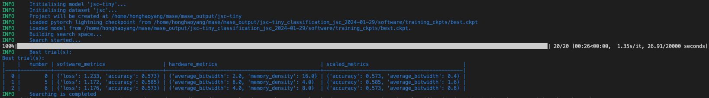

# Lab3

1. For evaluating the quality of the quantization, the following metrics can be taken into considerations:
   - Latency
   - model size
   - number of FLOPs 
   - number of BitOPs


2. Implement `latency metric` by inserting the following codes to the search rounds. 
   ```python
   import time
   start = time.time()
   preds = mg.model(xs)
   end = time.time()
   ```
   The outputs of the `latency` matrics are
   ```
   [0.0005010536738804408, 0.0004582745688302176, 0.00045984131949288506, 0.0004649843488420759, 0.0004684243883405413, 0.0004639625549316406, 0.00046644892011369975, 0.0004534721374511719, 0.0004597391401018415, 0.00046450751168387275, 0.00044230052403041294, 0.0004691055842808315, 0.00045997755868094306, 0.00045428957257952007, 0.00045864922659737725, 0.0004451615469796317]
   ```
   
   In this case, the reasons that accuracy and loss serve as the same quality metric are two-fold:
   1. They are highly negatively correlated, a low loss always indicates a high accuracy.
   2. They evalute the same persepective of how great the model fits the data while other metrics like latency measures how fast the model is running and the model size measures how much memory the model takes.

3. Implement the brute force search by adding brute force sampler in the `sampler_map` function in `optuna.py`.
   ```python
   def sampler_map(self, name):
        match name.lower():
            ### add brute-force
            case "brute-force":
                sampler = optuna.samplers.BruteForceSampler(seed=1)
            case "random":
                sampler = optuna.samplers.RandomSampler()
            case "tpe":
                sampler = optuna.samplers.TPESampler()
            case "nsgaii":
                sampler = optuna.samplers.NSGAIISampler()
            case "nsgaiii":
                sampler = optuna.samplers.NSGAIIISampler()
            case "qmc":
                sampler = optuna.samplers.QMCSampler()
            case _:
                raise ValueError(f"Unknown sampler name: {name}")
        return sampler
   ```

4. Compare brute-force search with tpe based search which is default setting in `jsc_toy_by_type.toml`. We can get the following results.
   
   For tpe search, the results are
   
   For brute search, the results are
   
   

   From the results, we can see that brute force may run a little bit longer than tpe method for each iterations while tpe runs more rounds for searching the best choice. This can be due to the limited search size because tpe should be more efficient search method than brute-force.